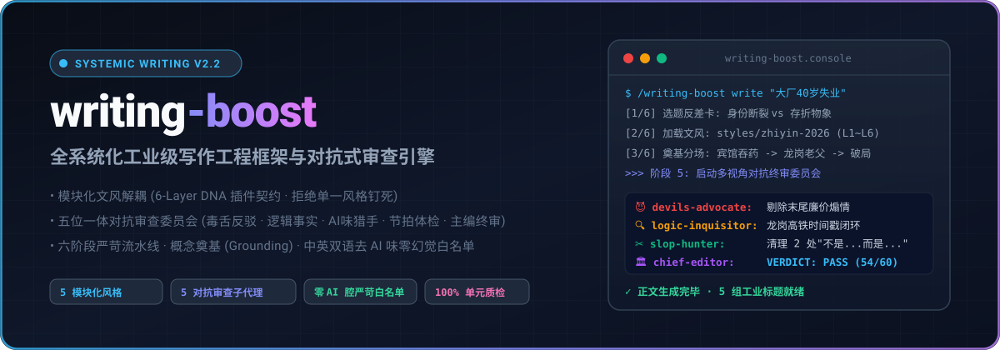
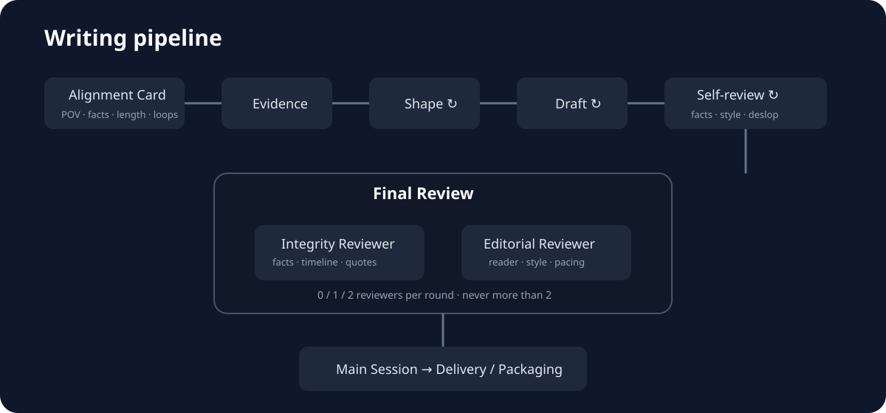

<div align="center">

# ⚡ writing-boost

### 全系统化工业级写作工程框架 · 模块化文风解耦 · 五位一体对抗式终审委员会

[](SKILL.md)
[](styles/style-contract.md)
[](references/review-council.md)
[](references/deslop-whitelist-zh.md)
[](tests/)
[](LICENSE)

<br/>

<p align="center">
  
</p>

**让每一篇非虚构故事、特稿报道与长文，都拥有法医级的事实重力与电影分镜式的叙事张力。**  
彻底告别“不是……而是……”翻案腔、假转折、道德爹味说教与空洞的大模型修辞套话。

[快速上手](#-快速上手) • [核心创新](#-四大核心工程创新) • [模块化文风](#-模块化可插拔文风引擎) • [对抗式审查](#-五位一体对抗式审查委员会) • [流水线拓扑](#-全生命周期六阶段流水线) • [测试验证](#-工程严谨性与单元质检)

</div>

---

## 💡 为什么需要 writing-boost？

在大语言模型被广泛用于写作的今天，几乎所有文本都陷入了严重的**“AI 同质化泥潭”**：
- **修辞浮肿**：充斥着“不可否认的是”、“留下了浓墨重彩的一笔”、“心猛地一沉”等三流网络套话；
- **结构死板**：三元排比强迫症、假对称翻案腔（“不是……而是……”），句子读起来节奏单调催眠；
- **道德爹味**：作者比读者先哭，结尾强行总结人生哲理或灌输正能量口号；
- **风格钉死**：传统提示词将文风硬编码，无法在纪实特稿、调查报道、商业内幕与个人回忆录之间灵活切换。

**`writing-boost` 用严格的软件工程思维重构写作**：以物理物象奠基、将文风完全解耦为插件、通过 4 个互相掐架的专职审稿子代理与 1 个主编进行法医级质检。

### 🔄 写作质感直观对比 (Before & After)

| 传统大模型平庸生成 (AI Slop) | `writing-boost` 工业级输出 (Grounded Prose) |
| :--- | :--- |
| *“中年失业的他感到万念俱灰。这不仅是一场职场的滑铁卢，更是他人生的至暗时刻。然而，他没有被命运击垮，眼神中依然闪烁着希望的微光，在时代的洪流中继续坚定地前行。”* | *“下午四点，老温在快捷宾馆退了房。包里沉甸甸的，装着两瓶没开封的安眠药，和老父亲那张从未动过的活期存折。深圳下着冬雨，龙岗工业区拉开铁卷闸门的刺耳声里，他把淋湿的简历塞进了垃圾桶。”* |
| ❌ **病理**：空洞形容词堆砌、翻案假转折、毫无物理现场感、廉价正能量。 | ✅ **质感**：**短动词串联**、**三件承重物象**（安眠药、存折、湿简历）、**微观声响**、**零道德说教**。 |

---

## 🏛️ 四大核心工程创新

```text
┌────────────────────────────────────────────────────────────────────────┐
│                        WRITING-BOOST 架构支柱                          │
├───────────────────┬───────────────────┬────────────────────────────────┤
│ 1. 模块化风格引擎 │ 2. 对抗审查委员会 │ 3. 概念奠基与节拍推进          │
│   (styles/)       │   (agents/)       │   (Grounding & Beats)          │
│ • 6-Layer DNA契约 │ • 毒舌反驳者       │ • Matt Pocock 规范             │
│ • 5 款即插即用预装│ • 逻辑事实质检官  │ • 前 15% 极速极限切片 Hook     │
│ • 杜绝风格单一钉死│ • AI味假转折猎手  │ • 中段 70% 场景电荷正负反转    │
│ • 自由定制扩展    │ • 节拍共情体检官  │ • 后 15% 核心物象克制余响      │
│                   │ • 总编辑权威仲裁  │ • 零脑补、绝对信息守恒         │
└───────────────────┴───────────────────┴────────────────────────────────┘
```

---

## 🎨 模块化可插拔文风引擎 (Pluggable Style Engine)

写作风格绝不钉死。`writing-boost` 实现风格与引擎完全解耦，所有文风必须履行 [`styles/style-contract.md`](styles/style-contract.md) 六层 DNA 接口：

<div align="center">

| 风格 ID | 风格全称 | 核心题材定位 | 情感温度与语调 | 承重反差与物象锚定 |
| :--- | :--- | :--- | :--- | :--- |
| **`zhiyin-2026`**<br/>*(旗舰基准)* | 知音纪实特稿·极致反差与物象锚定 | 时代人物、草根突围、真实社会纪实 | 苍凉温热 · 粗粝克制 · 平视众生 | 8组现实反差轴 · 12大结构模型 A~L · 3件核心物象 |
| **`investigative`** | 深度调查特稿·硬核冷峻与证据闭环 | 严肃调查、商业黑幕、复杂公共议题 | 极度冷峻 · 手术刀式精准 · 零抒情 | 双源交叉印证 · 法律时间戳 · 财务证据闭环 |
| **`personal-memoir`** | 个人非虚构·克制内省与私人记忆 | 家族回忆录、亲情散文、自我生命史 | 温润沉郁 · 隐忍内省 · 去抒情化 | 私人物象考古 · 时空双轨螺旋 · 遗憾承认 |
| **`tech-insider`** | 科技商业特稿·技术哲思与产业暗流 | 商业深度剖析、硅谷/中国科技叙事 | 极客锐利 · 理性推演 · 反公关通稿 | 第一性原理 · 代码/算力细节 · 创始人心理切面 |
| **`travelogue`** | 人文地理漫游·空间拓扑与历史余温 | 文化地理漫记、深度文旅散文、地方志 | 苍茫博大 · 诗意凝视 · 拒绝打卡腔 | 空间折叠 · 地方志微物 · 方言声腔风土 |

</div>

```bash
# 列出系统已安装的所有风格
/writing-boost style list

# 指定风格启动写稿流水线
/writing-boost write "大模型算力墙背后的百亿暗战" --style tech-insider

# 基于契约脚手架创建你的自定义风格
/writing-boost style new financial-crime
```

---

## 😈 五位一体对抗式审查委员会 (Adversarial Review Council)

在稿件成形后，由 **4 位专职质检子代理 + 1 位主编总审判官** 组成的对抗委员会启动红黑交叉质检：

<p align="center">
  
</p>

### 委员会成员与质检靶点

1. 😈 **`devils-advocate` 毒舌反驳者与怀疑论审判官** ([`agents/devils-advocate.md`](agents/devils-advocate.md))
   - **专查**：廉价煽情（作者比读者先哭）、道德爹味说教、纸片人脸谱化、廉价和解、读者翻白眼出戏点。
2. 🔍 **`logic-inquisitor` 逻辑与物理事实质检官** ([`agents/logic-inquisitor.md`](agents/logic-inquisitor.md))
   - **专查**：生理机能极限、时间线悖论、空间瞬移、**信息守恒（零幻觉脑补）**。
3. ✂️ **`slop-hunter` AI味与假转折猎手** ([`agents/slop-hunter.md`](agents/slop-hunter.md))
   - **专查**：“不是……而是……”翻案腔、喉头清理虚词、三元对称机械排比、破折号滥用。
4. 💓 **`pacing-auditor` 节拍与共情体检官** ([`agents/pacing-auditor.md`](agents/pacing-auditor.md))
   - **专查**：前 15% 黄金 Hook 强度、概念奠基阶梯、场景张力电荷反转、终局物象收尾。
5. 🏛️ **`chief-editor` 主编总评与裁定仲裁官** ([`agents/chief-editor.md`](agents/chief-editor.md))
   - **职能**：裁决审查分歧、评定加权终审分数（满分 60 分）、下达**退修三部曲手术单**、行使终审一票否决权。

> **通关硬门禁**：单项 $\ge 7$ 分且总分 $\ge 45/60$；触碰一票否决红线（事实造假/严重翻案腔/空洞道德升华）强制退修。

---

## 🚀 快速上手 (Quick Start)

### 1. 安装到当前环境

将本 Skill 安装到 Agent 技能目录中（支持 Antigravity / Claude Code / OpenCode / Codex）：

```bash
# 复制或符号链接至技能目录
cp -r writing-boost ~/.agents/skills/writing-boost
# 或针对项目级配置
cp -r writing-boost agyskill/writing-boost
```

### 2. 常用交互命令速查

| 指令 | 说明 | 适用场景 |
| :--- | :--- | :--- |
| `/writing-boost` | 交互式全流程向导 | 首次使用，引导选题与风格选择 |
| `/writing-boost explore [主题]` | 挖掘素材碎片与承重先导词 | 只有模糊想法，无大纲时的头脑风暴 |
| `/writing-boost shape [素材]` | 建立概念奠基与电影分镜节拍表 | 理清叙事主干与场景电荷反转 |
| `/writing-boost write [大纲] --style [ID]` | 驱动流水线分场写稿 | 正文草稿生成（默认 zhiyin-2026） |
| `/writing-boost review [稿件]` | 启动五位一体对抗审查委员会 | 完稿后的法医级挑刺与主编裁决 |
| `/writing-boost deslop [稿件]` | 执行中英文双语去 AI 味清洗 | 逐行剔除翻案腔与机械对称 |
| `/writing-boost package [稿件]` | 5 组工业爆款标题与多端分发矩阵 | 公众号 / X / 小红书适配转译 |

---

## 🧪 工程严谨性与单元质检 (Verification Record)

本项目包含完备的自动化测试套件与静态资产核查器：

```bash
# 运行全套单元测试 (包含模块化风格、多代理提示词、链接完整性)
python3 -m unittest tests/test_writing_framework.py

# 运行 README 静态资产与 SVG 合规性审计
python3 /Users/cc/.agents/skills/beautify-github-readme/scripts/audit_readme.py agyskill/writing-boost/README.md
```

- ✅ **10/10 单元测试全部通过** (覆盖 11 篇 2026 精研样本、12 种结构模型 A~L、5 大模块化风格、5 大对抗代理)
- ✅ **全项目 Markdown 内部链接 100% 完整无死链**
- ✅ **SVG 矢量资源 100% 符合 GitHub 渲染标准 (无外链、无危险脚本、带独立 title 与自适应 viewBox)**

---

## 📁 目录架构全景

```text
writing-boost/
├── SKILL.md                          # 核心调度引擎定义与渐进披露门禁
├── README.md                         # 视觉化工程主页
├── agents/                           # 五位一体对抗式审查委员会提示词
│   ├── devils-advocate.md            # 😈 毒舌反驳者与怀疑论审判官
│   ├── logic-inquisitor.md           # 🔍 逻辑与物理事实质检官
│   ├── slop-hunter.md                # ✂️ AI味与假转折猎手
│   ├── pacing-auditor.md             # 💓 节拍与共情体检官
│   └── chief-editor.md               # 🏛️ 主编总评与裁定仲裁官
├── styles/                           # 模块化可插拔风格仓库
│   ├── style-contract.md             # 6-Layer DNA 风格接口规范契约
│   ├── README.md                     # 风格索引与开发指南
│   ├── zhiyin-2026/style.md          # 旗舰基准：知音纪实特稿
│   ├── investigative-feature/style.md# 深度调查特稿
│   ├── personal-memoir/style.md      # 个人非虚构回忆录
│   ├── tech-insider/style.md         # 科技商业深度特稿
│   └── literary-travelogue/style.md  # 人文地理漫游散文
├── references/                       # 核心工程规范参考库
│   ├── review-council.md             # 审查委员会运行与会审协议
│   ├── zhiyin-dna.md                 # 知音 2026 全量 6-Layer DNA 详案
│   ├── grounding-and-beats.md        # Matt Pocock 概念奠基与节拍推进规范
│   ├── story-pipeline.md             # 故事工业化六阶段流水线详解
│   ├── deslop-whitelist-zh.md        # 中文去 AI 味严苛白名单
│   ├── deslop-prose-en.md            # 英文去 AI 味与修剪规范
│   └── social-packaging.md           # 5 组工业标题公式与多端衍生
├── templates/                        # 工业级标准化作业卡
│   ├── raw-fragments.md              # 探索阶段原生态素材卡
│   ├── topic-evaluation.md           # 选题反差张力立项卡
│   ├── character-evidence-card.md    # 人物物象深潜卡
│   ├── chapter-beat-sheet.md         # 概念奠基与分场节拍表
│   └── review-scorecard.md           # 六维深度审稿会审成绩单
└── assets/                           # 矢量图解与视觉资源
    └── readme/
        ├── hero-banner.svg           # 动态色谱高精 Hero Banner
        └── pipeline-architecture.svg # 全生命周期流水线系统拓扑图
```

---

<div align="center">

**Made with craft by the Writing Lab System**  
*Refuse mediocrity. Ground every sentence in truth.*

</div>
